# 🐷🦆 小猪鸭记账 — 作品展示

> **萌系智能记账 Android 应用** | 独立全栈开发 | Kotlin + Jetpack Compose + Clean Architecture + AI

<p align="center">
  
  
  
  
  
  
  
  
  
</p>

---

## 📌 项目简介

小猪鸭记账是一款面向年轻人的**萌系卡通智能记账应用**，采用 Kotlin + Jetpack Compose 构建，以珊瑚粉色为主调、圆润卡片和微动画打造治愈系体验。支持手动记账、AI 自然语言记账、拍照 OCR 记账、语音记账、统计报表、预算管理等 **12 项核心功能**，涵盖本地离线与 AI 在线两大场景。

| 项目规模 | 数值 |
|---------|------|
| Kotlin 源文件 | ~75 个 |
| 代码行数 | ~9,500 行 |
| 页面数 | 15 个 |
| 数据库表 | 4 张 |
| UseCase | 11 个 |
| Git 提交 | 20+ |
| 开发周期 | 5 天（从零到 v0.1.2） |

> ⚠️ **注意**：本仓库为作品展示仓库，**不含源代码**。源码存放于私有仓库。如需了解技术细节，请阅读下方文档或浏览 GitHub Pages 网站。

---

## ✨ 核心功能

| 功能 | 说明 | 离线可用 |
|------|------|:---:|
| 📝 **手动记账** | 自定义数字键盘 + 分类网格选择 + 备注/日期 + 图片附件 | ✅ |
| 🤖 **AI 对话记账** | 自然语言描述收支，支持口语化表达，AI 自动解析金额/分类/日期 | ❌ |
| 🔄 **对话纠错** | "不对，是交通"、"金额改成30"，AI 自动修正 | ❌ |
| 📷 **拍照记账** | ML Kit OCR 识别小票/截图 → AI 结构化解析 | ❌ |
| 🎤 **语音记账** | SpeechRecognizer 语音转文字 → AI 解析 | ❌ |
| 📋 **账单管理** | 日期分组、搜索、多维度筛选、左滑删除、批量操作 | ✅ |
| ✏️ **账单编辑** | 点击任意记录进入详情页，编辑金额/类型/分类/备注/日期 | ✅ |
| 📊 **统计报表** | 自绘 Canvas 折线图/柱状图，日/周/月/年维度 + 分类排行榜 | ✅ |
| 📅 **日历视图** | 月历网格展示每日收支，点击查看日明细列表 | ✅ |
| 💰 **预算管理** | 月度预算设置 + 实时进度条 + 超支提醒 | ✅ |
| 🏷️ **分类管理** | 16 个预置分类 + 自定义新增/编辑/删除 + 颜色选择器 | ✅ |
| 📤 **数据导入导出** | CSV/JSON 双格式导出 + 自动格式识别导入 + 系统分享 | ✅ |
| 📈 **AI 月度报告** | 智能消费分析 + 省钱建议（小猪鸭语气） | ❌ |
| 🧩 **桌面小组件** | Jetpack Glance 构建，桌面展示本月收支 | ✅ |
| ⚡ **快捷磁贴** | 下拉通知栏一键打开 AI 记账 | ✅ |

---

## 🛠 技术栈

| 类别 | 技术 | 版本 | 用途 |
|------|------|------|------|
| 语言 | Kotlin | 1.9.22 | 主开发语言 |
| UI 框架 | Jetpack Compose + Material 3 | BOM 2024.02 | 声明式 UI |
| 架构 | MVVM + Clean Architecture | — | 三层分层架构 |
| 数据库 | Room | 2.6.1 | 本地 SQLite ORM |
| 依赖注入 | Hilt | 2.50 | 全应用 DI |
| 导航 | Navigation Compose | 2.7.7 | 页面路由 + 底部导航 |
| 网络 | Retrofit + OkHttp | 2.9.0 / 4.12.0 | HTTP 客户端 |
| AI API | DeepSeek API | v4-flash / chat | 自然语言解析 + 报告生成 |
| OCR | Google ML Kit | 16.0.0 | 中文文字识别 |
| 语音 | Android SpeechRecognizer | — | 语音转文字 |
| 序列化 | Kotlinx Serialization | 1.6.2 | JSON 序列化 |
| 图表 | Compose Canvas 自绘 | — | 折线图 + 柱状图（无第三方） |
| 图片加载 | Coil | 2.5.0 | 图片异步加载 |
| 小组件 | Jetpack Glance | 1.0.0 | 桌面小组件 |
| 状态管理 | StateFlow + Flow | 1.7.3 | 响应式数据流 |

---

## 🏗 架构设计

项目采用 **MVVM + Clean Architecture** 三层架构，严格遵循单向数据流（UDF）：

```
┌─────────────────────────────────────────────────────┐
│  Presentation Layer                                 │
│  Compose UI ←→ ViewModel (StateFlow)               │
│  • 15 个 Screen • 10 个 ViewModel                  │
│  • 动画系统 • 设计 Token 系统            │
├─────────────────────────────────────────────────────┤
│  Domain Layer                                       │
│  UseCase ← Repository Interface ← Domain Model     │
│  • 11 个 UseCase • 3 个 Repository 接口             │
│  • 4 个 Domain Model • 纯 Kotlin（无框架依赖）      │
├─────────────────────────────────────────────────────┤
│  Data Layer                                         │
│  Local: Room (DAO + Entity)                        │
│  Remote: Retrofit + OkHttp (DeepSeek API)           │
│  • 3 个 DAO • 4 个 Entity • 1 个 API Service       │
│  • TypeConverter • PrepopulateData                 │
└─────────────────────────────────────────────────────┘
```

**核心设计决策**：
- **日期归一化**：所有交易日期存储时归一化到当天零点，确保 `GROUP BY date` 查询正确聚合
- **Flow 响应式**：DAO 返回 `Flow<List<T>>`，数据变化时 ViewModel 自动感知，UI 无需手动刷新
- **Entity → Domain 映射**：Repository 负责转换，Domain 层不依赖 Room 注解
- **离线优先**：手动记账、统计、账单管理等核心功能完全离线可用；AI 功能检测网络状态后优雅降级

详细架构文档 → [架构设计页面](https://jizhualiuliubei.github.io/airecord-showcase/architecture)

---

## 🔥 技术亮点

### 1. AI 自然语言记账系统

构建了完整的 AI 记账管线：Prompt 工程 → 多条目解析 → 分类模糊匹配 → 对话式纠错。

**Prompt 设计**包含：日期参考上下文、日期推断规则、"两千/一百来块"等口语化金额推断、每分类关键词映射、10 个多样化示例。AI 返回 JSON 后，通过5级分类匹配策略（精确→包含→被包含→归一化→兜底），将 AI 输出的分类名精准映射到本地分类。

```
用户："午饭20，打车10，给妈妈转500红包"
  → AI 解析为 3 条结构化记录
  → 自动分类：餐饮/交通/人情
  → 用户确认 → 3 条同时入库
```

### 2. 多模态输入统一管线

三种输入方式（文字/拍照/语音）统一汇聚到同一个 AI 解析管线：

```
文字输入 ─────────────────────────────┐
拍照 → ML Kit OCR → 提取文字 ────────┤→ DeepSeek API → JSON 解析 → 确认卡片 → 入库
语音 → SpeechRecognizer → 文字 ──────┘
```

ML Kit 使用 `ChineseTextRecognizerOptions` 确保中文识别准确率，图片自动压缩到 1024px 避免 OOM。语音识别使用 `SpeechRecognizer` 直接 API（非系统对话框），自定义 UI 带声波动画。

### 3. 自绘 Canvas 图表系统

统计图表完全使用 Compose `Canvas` 自绘，**无第三方图表库依赖**。

- **折线图**：Catmull-Rom 平滑曲线，Y 轴控制点钳制避免过度摆动，渐变填充区域
- **柱状图**：日视图双柱对比（支出/收入），`verticalGradient` 渐变色彩，点击弹性缩放
- **交互**：`detectTapGestures` 点击数据点弹出详情 panel，虚线辅助线定位
- **自适应**：X 轴标签根据数据密度自动调整显示频率（≤12 全显，>20 隔三显）

### 4. 离线优先架构

核心功能（记账、查询、统计、预算、分类）完全本地运行，AI 功能通过 `NetworkMonitor`（`ConnectivityManager.NetworkCallback` 基于 Flow 的网络监听）检测后优雅降级：
- 在线 → AI 按钮可点击
- 离线 → AI 按钮灰显 + "需要联网使用"提示


---

## 🗄 数据库设计

| 表名 | 说明 | 关键字段 | 索引 |
|------|------|----------|------|
| `transactions` | 交易记录 | amount, type, category_id, date, note | date, type, category_id, (date,type) |
| `categories` | 收支分类 | name, icon_name, color, is_income | — |
| `budgets` | 预算管理 | amount, month, category_id | month, category_id, (month,category_id) UNIQUE |
| `attachments` | 图片附件 | transaction_id, file_path | transaction_id |

**核心 SQL 查询**：
- `getDailySummary`：`strftime` 按天聚合，用于折线图数据
- `getCategorySummary`：LEFT JOIN + GROUP BY 分类聚合，用于饼图和排行榜
- `getFiltered`：7 条件可选组合筛选（分类/类型/金额区间/关键词/日期范围）

---

## 📱 页面导航

```
底部导航栏（4 Tab）
├── 🏠 首页 (HomeScreen)         — 月度概览 / 最近账单 / 预算进度
├── 📋 账单 (BillListScreen)      — 日期分组 / 搜索 / 筛选 / 左滑删除
├── 📊 统计 (StatisticsScreen)    — 自绘图表 / 分类排行
└── 👤 我的 (ProfileScreen)       — 功能入口 / 记账天数

子页面（15 页面，滑入转场动画）
├── 手动记账 (RecordScreen)       — 数字键盘 + 分类网格 + 成功撒花动画
├── AI 记账 (AiRecordScreen)      — 对话式 + 拍照 + 语音 + 分类编辑
├── 日历视图 (CalendarScreen)     — 月历网格 + 日明细
├── 账单详情 (BillDetailScreen)   — 金额/类型/分类/备注/日期编辑
├── 预算管理 (BudgetScreen)       — 进度条 + 超支警告
├── 分类管理 (CategoryManageScreen) — CRUD + 颜色选择器
├── 数据管理 (ExportScreen)       — CSV/JSON 导入导出
├── AI 月报 (AiReportScreen)      — 消费分析 + 省钱建议
├── API 设置 (ApiKeySettingsScreen) — Key 管理 + 有效性测试
├── 使用说明 (UsageGuideScreen)   — 可折叠卡片 10 板块
└── 筛选弹窗 (BillFilterSheet)    — 6 维度组合筛选
```

---

## 📸 截图展示

| 截图 | 说明 | 截图 | 说明 |
|------|------|------|------|
| 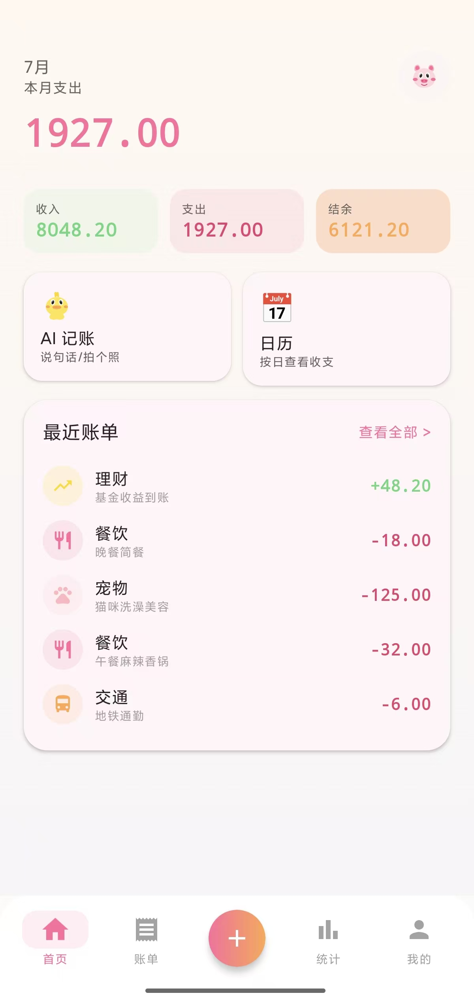 | 🏠 首页概览 |  | 📝 手动记账 |
|  | 🤖 AI 对话 |  | 🎤 语音记账 |
|  | 📷 拍照 OCR | 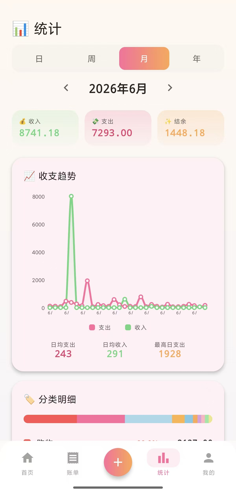 | 📊 统计图表 |
| 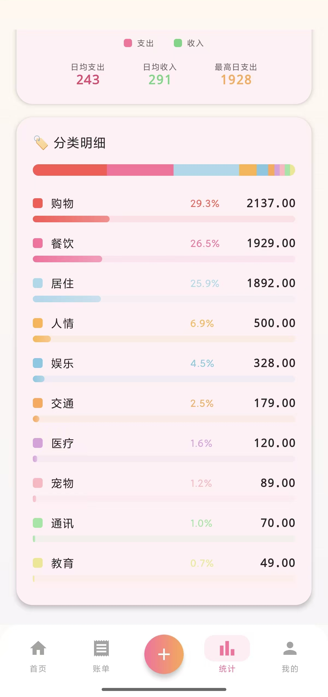 | 🏆 分类排行 | 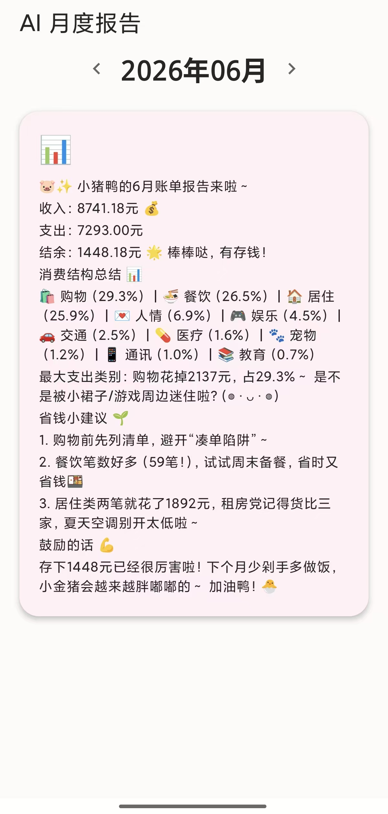 | 📈 AI 月报 |
| 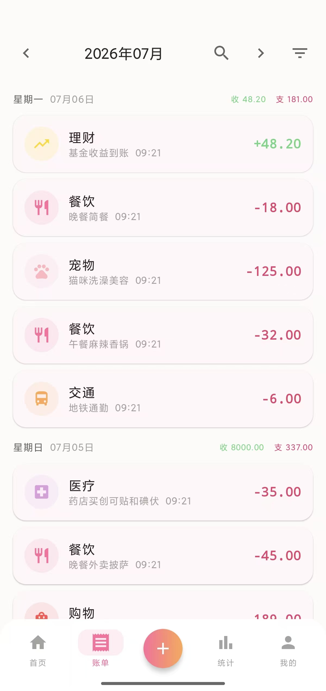 | 📋 账单列表 | 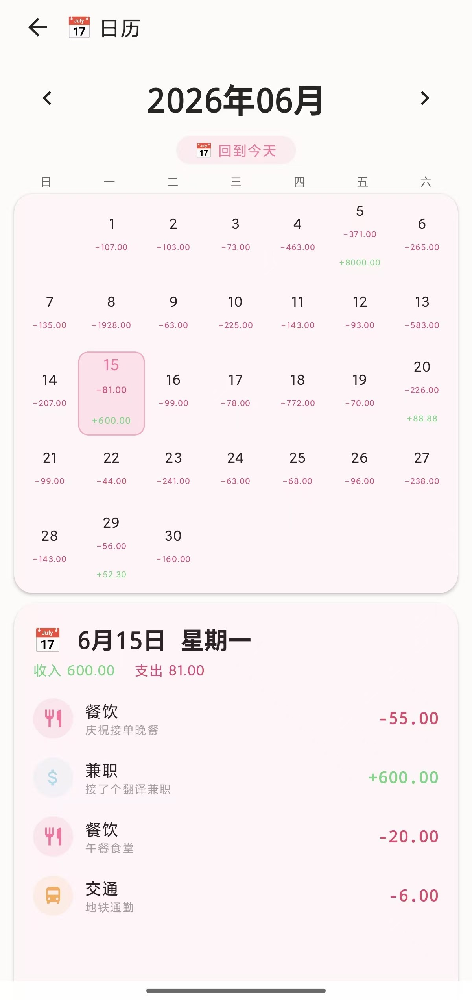 | 📅 日历视图 |
| 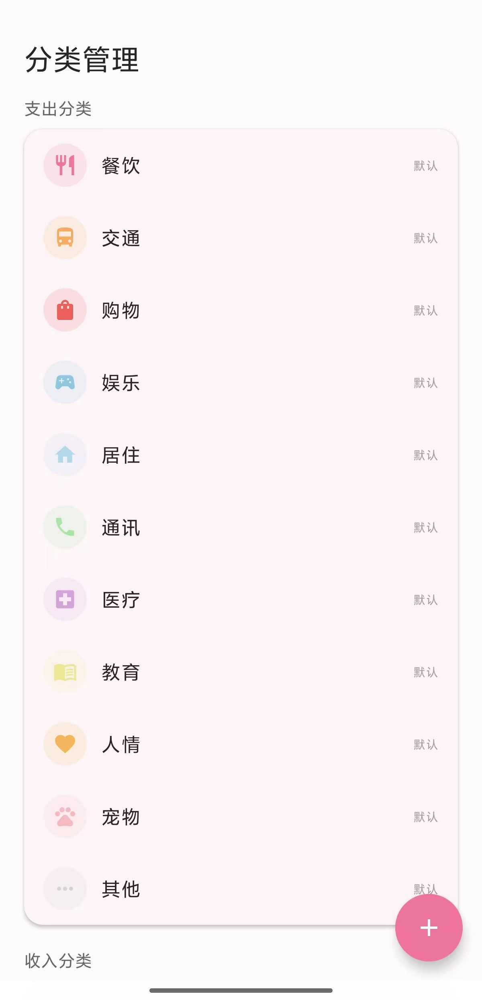 | 🏷️ 分类管理 | 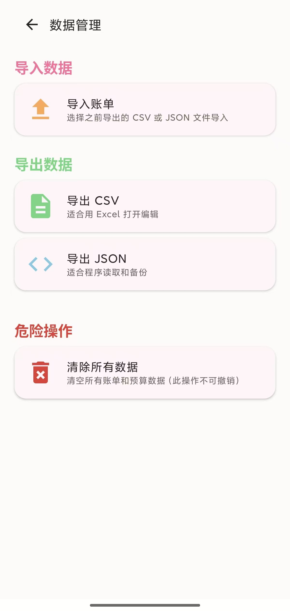 | 📤 数据管理 |
| 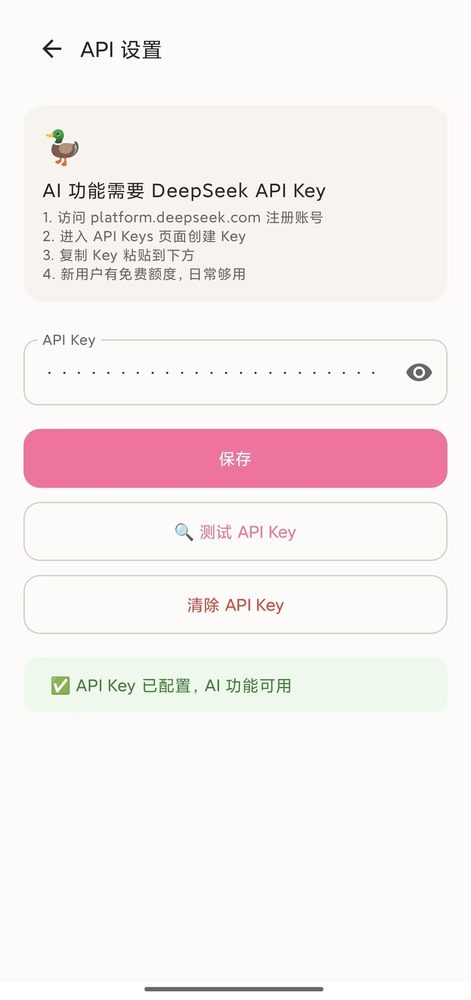 | 🔑 API 设置 | 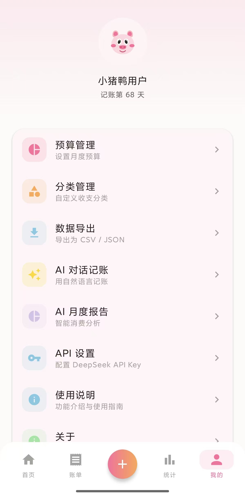 | 👤 个人中心 |
| 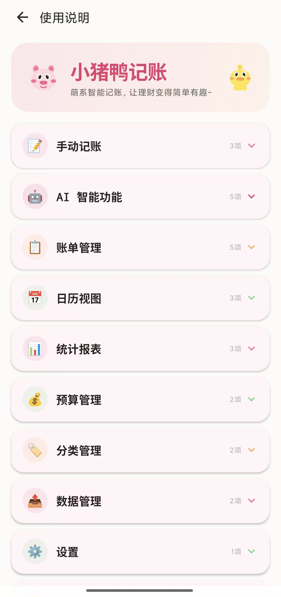 | 📖 使用说明 |

> 📸 [点击查看全部 15 张截图大图](https://jizhualiuliubei.github.io/airecord-showcase/screenshots)

---

## 📦 APK 下载

前往 [GitHub Releases](https://github.com/jizhualiuliubei/airecord-showcase/releases) 下载最新版本 APK。

| 版本 | 日期 | 主要更新 |
|------|------|---------|
| v0.1.2 | 2026-07-06 | 修复 CSV/JSON 导出日期时间显示为 00:00 的问题 |
| v0.1.1 | 2026-06-01 | AI 记账、拍照/语音/日历/搜索/数据导入 |
| v0.1.0 | 2026-05-28 | MVP：手动记账、账单、统计、预算、分类、导出 |

**安装要求**：Android 8.0 (API 26)+ | 约 43 MB（含 ML Kit 中文 OCR 模型）

---

## 📚 在线展示

| 页面 | 内容 |
|------|------|
| [🏠 项目首页](https://jizhualiuliubei.github.io/airecord-showcase/) | Hero 落地页 + 特性展示 + 技术栈 + 数据统计 |
| [🏗 架构设计](https://jizhualiuliubei.github.io/airecord-showcase/architecture) | 三层架构详解、数据流、状态管理、关键技术决策 |
| [📸 截图画廊](https://jizhualiuliubei.github.io/airecord-showcase/screenshots) | 全部 15 张实机截图、分类浏览、点击放大 |
| [🔥 技术亮点](https://jizhualiuliubei.github.io/airecord-showcase/tech) | 6 大技术成就深度解析（AI/OCR/Canvas/设计系统） |
| [📖 使用说明](https://jizhualiuliubei.github.io/airecord-showcase/usage-guide) | 11 步详细图文教程 · 常见问题解答 · 适合新手 |

> 👉 **建议直接访问 [GitHub Pages](https://jizhualiuliubei.github.io/airecord-showcase/) 获得最佳浏览体验** — 包含交互式架构图、截图轮播、代码示例等。

---

> 🐷🦆 小猪鸭记账 — 让记账变得可爱又有趣！